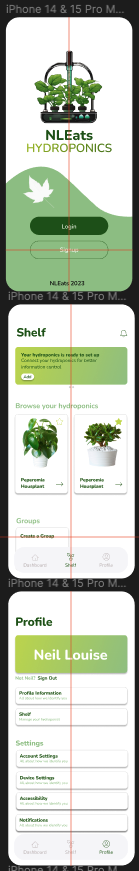

# NLEats Hydroponics: Hydroponics Management Application

NLEats Hydroponics is a mobile application designed to connect and manage hydroponics systems effortlessly. Whether you're a hobbyist or a professional grower, HydroConnect provides a user-friendly interface to monitor and control your hydroponics setup remotely.

## Features

- **Real-time Monitoring:** Keep track of vital metrics such as water pH, nutrient levels, and temperature in real-time.

- **Control Systems:** Adjust and control various aspects of your hydroponics system, including water pumps, nutrient dosing, and LED lighting.

- **Data Analytics:** Analyze historical data trends to optimize plant growth conditions and maximize yields.

- **Alerts and Notifications:** Receive instant alerts and notifications for critical events, ensuring prompt action for system maintenance.

## Getting Started

### Prerequisites
- Node.js installed
- Expo CLI installed

### Usage
- Open the HydroConnect app on your mobile device.
- Connect your hydroponics system by entering the required details.
- Monitor and control your hydroponics setup in real-time.
- Analyze historical data and receive alerts for optimal plant care.

## Contact

For inquiries and support, please contact me at neillouise03@gmail.com.

